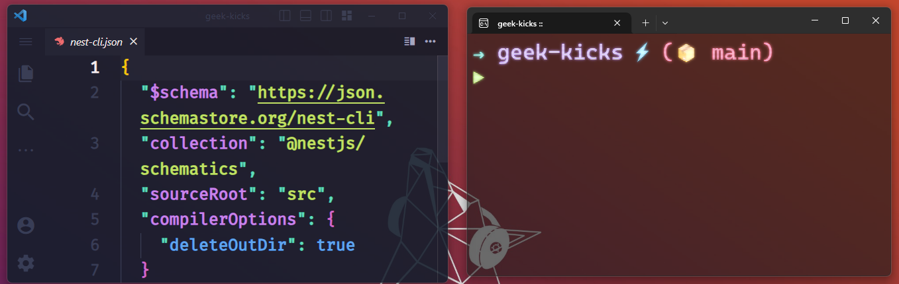

  

## 📌  *Info*
All my personal configs and settings files from my dev ambience PC.

# Operational System
- **OS**: [Windows 11](https://www.microsoft.com/pt-br/software-download/windows11)
- **Package Manager**: [Chocolatey](https://chocolatey.org/)
- **Terminal**: [Windows Terminal](https://github.com/microsoft/terminal)
- **Icons Theme**: [Sweet Paranoia](https://vsthemes.org/en/icon/ipack/18014-sweet-paranoia.html)

# Ambience Development (General)
- **Editor Code**: [Visual Studio Code](https://code.visualstudio.com/)
  - theme: [HackTheBox](https://marketplace.visualstudio.com/items?itemName=silofy.hackthebox)
  - icons-set: [Symbols](https://marketplace.visualstudio.com/items?itemName=miguelsolorio.symbols)
  - editor font: [FireCode](https://github.com/tonsky/FiraCode)
  - terminal font: [Operator Mono](https://github.com/keyding/Operator-Mono)
  - shell prompt tool: [Starship](https://starship.rs/)
  - menu appearance: [Fluent UI for VSCode](https://marketplace.visualstudio.com/items?itemName=leandro-rodrigues.fluent-ui-vscode)
  - my vscode settings: [Settings.json](https://github.com/felipeAguiarCode/my-settings-files/blob/main/ambience-development/vsual-studio-code/settings/settings.json)

  # Subsystem
- **Windows Subsystem for Linux**: [WSL2](https://docs.microsoft.com/en-us/windows/wsl/install)
  - how to install: [WSL2](https://github.com/felipeAguiarCode/my-settings-files/blob/main/ambience-development/wsl2-linux/how-to-install.md)
  - WSL2 Terminal: [Zsh + Oh My Posh](https://github.com/felipeAguiarCode/my-settings-files/blob/main/ambience-development/wsl2-linux/wsl2-terminal-oh-my-zsh/how-to-install-oh-my-zsh.md)
  - WSL2 Terminal Theme: [Spaceship]

# Chrome Extensions
- **JSON Viewer**: [JSON Viewer](https://chrome.google.com/webstore/detail/json-viewer/gbmdgpbipfallnflgajpaliibnhdgobh)
- **Octotree - GitHub code tree**: [Octotree - GitHub code tree](https://chrome.google.com/webstore/detail/octotree-github-code-tree/bkhaagjahfmjljalopjnoealnfndnagc)
- **Dark Reader**: [Dark Reader](https://chrome.google.com/webstore/detail/dark-reader/eimadpbcbfnmbkopoojfekhnkhdbieeh?hl=en)

***
💜 Feel free to copy and make your PC amazing :D